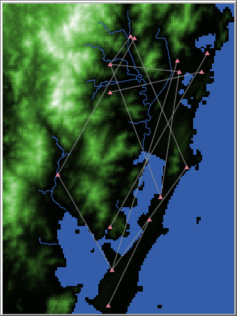

------------------------------------------------------------------------

# **Agent-Based Model**

Nesta seção estão disponibilizadas as informações relativas aos modelos baseado em agentes (ABM) produzido na tese. O modelo foi construído no software NetLogo 6.2, que pode ser obtido de forma gratuita [aqui](https://ccl.northwestern.edu/netlogo/).

Os arquivos para execução do modelo, código-fonte e relatório ODD também estão disponíveis para download neste [link](https://github.com/henrique-kozlowski/arqueologia), na pasta "modelos", ou então clicando nos títulos abaixo.

------------------------------------------------------------------------

## [Mobilidade](https://github.com/henrique-kozlowski/arqueologia/blob/main/modelo/Mobilidade.rar)

::: col-sm-6
{width="340"}
:::

::: col-sm-6
Este modelo tem como propósito simular a movimentação de populações sambaquieiras ao longo da região do complexo lagunar do litoral sul-catarinense. Neste modelo adaptamos técnicas de análise de caminhos de menor custo (*Least Cost Path*), comumente utilizadas em ambiente SIG, para um modelo baseado em agentes. A base para esta circulação é feita através de um mapa de custo de deslocamento, produzido no SIG. Os custos de deslocamento foram pensados de acordo com as particularidades do modo de vida das populações sambaquieiras, que era intensamente conectado e integrado aos corpos d'água da região. Portanto, muitas vezes os agentes optam pelo trânsito com canoas ao longo das lagoas. Os pontos de partida e destino são aleatórios, o objetivo do modelo não é definir uma rota real de deslocamento entre sítios, mas sim observar as formas de deslocamento na paisagem e as variações conforme diferentes valores de variáveis são experimentados.
:::

::: w-200
:::

------------------------------------------------------------------------

## [Redes e Dinâmicas](https://github.com/henrique-kozlowski/arqueologia/blob/main/modelo/Redes.rar)

::: col-sm-6

:::

::: col-sm-6
Este modelo simula dois aspectos da população sambaquieira no complexo lagunar do litoral sul catarinense: a ocupação do território e as possíveis redes de trocas entre as diferentes comunidades. O propósito desta simulação é compreender e explorar as diferentes formas de articulação das omunidades sambaquieiras no passado. Este modelo utiliza simplificações para simular os processos de criação de novas áreas de ocupação e também para simular áreas favoráveis para a ocupação humana. Não é um objetivo da simulação predizer áreas de maior probabilidade de ocorrência de sítios arqueológicos. Os padrões utilizados para explorar a articulação das comunidades são decorrentes das diferentes estratégias de troca utilizadas pelos agentes. O modelo simula duas formas de trocas, baseadas no trabalho de Sahlins e Graeber (2017): reciprocidade generalizada (*grn?* no modelo) e reciprocidade balanceada (*brn?* no modelo).
:::
